# Monitoring Story Model V1

This document is the scientific and product contract for the live story view.
It is intentionally stricter than the original retrospective prototype.

> **Archetype V2 status:** [`ARCHETYPE_V2.md`](ARCHETYPE_V2.md) supersedes the
> V1 prefix-motif method for current learned-archetype discovery and release
> decisions. Phase A uses one fixed causal event anchor, assigns at most one
> immutable archetype per event, and ends at an unreviewed diagnostic model. It
> does not change the V1 event-state semantics documented here and does not
> authorize a map release.

The completed V1 experiment produced **10,901 HDBSCAN groups from sampled
weekly event prefixes**. The count is a diagnostic of the V1 representation,
not a set of validated story types. Those groups remain unreviewed and must not
be published, used as a flat legend, or presented as agronomically meaningful
clusters.

## Verdict on the idea

The core idea is good: monitor a field as an evolving event, then group event
shapes into reusable motifs. It is more useful than clustering fields once or
coloring every day independently because it preserves onset, escalation,
persistence, response, and recovery.

The old implementation was not suitable for a live claim. It assigned a
complete-event sequence hash to earlier dates, learned spectral baselines from
the full observed season, and treated a truncated exact token sequence as a
cluster. Those artifacts remain useful for retrospective audit, but they are
not online clusters and they are not proof of cross-crop generalization.

V1 separates three objects:

| Object | Purpose | Identity |
|---|---|---|
| Event state | Operational state of one field episode using evidence available so far | Stable `event_id`, versioned state snapshots |
| Motif | Reusable archetype discovered from causal event-prefix features | Frozen `motif_id` within a model version |
| Activity-center trail | Weekly summary of the active field set for one selected motif | Aggregate only; never physical movement |

## What “a story starts here” means

A single noisy value should not start a confirmed incident. The starter policy
uses hysteresis:

- `WATCH`: evidence is accumulating but the incident is not confirmed.
- `ACTIVE`: repeated elevated pressure or aligned pressure plus a new crop
  response confirms the incident.
- `SEVERE`: a `HIGH` upstream risk or aligned severe response requires urgent
  review.

The exact thresholds live in
`story_monitor/policies/onset_policy_v1.json`. They are deliberately marked
uncalibrated. They are initial operating thresholds to validate with
agronomists, not biological constants.

The detection date is the first date the evidence rule is satisfied. A later
confirmation does not silently rewrite an alert as if it had been known
earlier. Candidate evidence and confirmation time can both be retained.

## What “the story ends” means

An event owns its quiet clock. It does not wait for a later event to arrive.
Quiet days count only when usable pressure observations exist; missing data
freezes the clock. A missing observation is displayed as `UNKNOWN` / `DATA_GAP`,
never converted into `NONE` risk. The most recent frozen motif assignment may
carry through that gap for continuity, but the gap cannot create a novel motif
or new evidence.

```mermaid
stateDiagram-v2
  [*] --> WATCH: persistent candidate evidence
  WATCH --> ACTIVE: confirmed pressure / aligned response
  WATCH --> CLOSED_WATCH_QUIET: observed quiet deadline
  ACTIVE --> SEVERE: high risk / aligned severe response
  ACTIVE --> QUIET_PENDING: pressure becomes quiet
  SEVERE --> QUIET_PENDING: pressure becomes quiet
  QUIET_PENDING --> ACTIVE: pressure relapses
  QUIET_PENDING --> CLOSED_RECOVERED: recovery confirmed
  QUIET_PENDING --> CLOSED_PRESSURE_QUIET_UNCONFIRMED: quiet, no fresh response
  QUIET_PENDING --> RECOVERING: crop response remains adverse
  RECOVERING --> ACTIVE: pressure relapses
  RECOVERING --> CLOSED_RECOVERED: recovery confirmed
  RECOVERING --> CLOSED_RESPONSE_UNRESOLVED: confirmation timeout
```



The system must not call a field “dead” from these inputs. Satellite-index
decline can support `SEVERE` or `CLOSED_RESPONSE_UNRESOLVED`, with
`requires_review=true`. Biological loss or crop death needs field observation,
yield/outcome evidence, or a separately validated model. A crop-instance
boundary closes an event as `CLOSED_SEASON_BOUNDARY`; it does not prove
recovery.

## Echo-aware crop response

`spectral_echo_days` is part of the evidence contract:

```text
spectral_source_date = observation_date - spectral_echo_days
```

Ten daily rows carrying the same Sentinel value count as one acquisition, not
ten confirmations. V1 compares unique acquisitions 7–21 days apart. Repeated
or stale values can preserve context but cannot create a new decline, extend a
decline streak, or prove recovery. Full-season z-scores are prohibited in the
online path because they use future observations.

A decline is attributed to a hazard only when current pressure evidence aligns
with that hazard. Otherwise it is `unattributed_decline` and requires review.

## Time and field granularity

The interface uses three linked resolutions instead of forcing one clustering
unit to do every job:

| Resolution | User question | Display |
|---|---|---|
| Field at week `t` | What is happening now? | Current risk, lifecycle, fresh evidence, action status |
| Field event prefix | How did this episode evolve? | Stepped lifecycle ribbon with gaps and evidence markers |
| Motif across fields | Where are similar active episodes appearing? | Polygons, entering/persisting/exiting counts, aggregate center and dispersion |

The clustering unit is an event prefix, not a whole field and not a calendar
week. Weekly snapshots make the prefix observable in the product while the
event retains a continuous identity.

A field may have concurrent hazard events. The map publishes one canonical
field/week row, ranked by open lifecycle state and current risk, so field counts
and geometry are not duplicated. Drill-down preserves every event in a separate
hazard lane. Peak risk is audit context; live filtering, ordering, and coloring
use current risk.

## Motif discovery

Motifs are trained offline from causal prefix snapshots, never from completed
event summaries projected backward in time.

This section describes V1 behavior for provenance. V2 does not cluster every
weekly prefix: it anchors each eligible event once at the 21st usable pressure
observation or an eligible earlier closure. Its exact eligibility, 20-feature
schema, four-way anchor-status ledger, temporal holdout, and gates are defined only in
[`ARCHETYPE_V2.md`](ARCHETYPE_V2.md).

Training cutoffs apply before prefix windows are built, and partial boundary
weeks are excluded. Daily pressure and response are event-specific; concurrent
hazards may share field-level weather/acquisition context but never each other's
attributed risk or crop-response evidence.

1. Stratify by the dominant hazard family so unrelated mechanisms cannot merge.
2. Robust-scale interpretable temporal features: current/peak/mean risk, slope,
   escalation counts, duration, lifecycle, stage, causal spectral changes,
   acquisition freshness, weather extremes, and data coverage.
3. Run HDBSCAN so variable-density groups and explicit noise are possible.
4. Store one observed prototype and a training-distance radius per accepted
   motif.
5. Freeze the model. Weekly updates assign to a prototype only when the state
   is inside its radius and sufficiently separated from the runner-up;
   otherwise the result is `novel_unassigned`.

Online distance is an assignment distance, not a calibrated probability. A new
training run creates a new model version and a reviewed lineage; it never
silently relabels already published snapshots.

H100 acceleration is useful for offline discovery and parameter sweeps. It is
not the solution for map scrubbing: geometry transfer, JSON parsing, and browser
polygon triangulation are the relevant timeline bottlenecks.

The viewer therefore fetches static geometry once, scrubs compact state rows,
keeps history opt-in, and serializes the all-history evolution query outside the
frame critical path. A local fixture showed 76% fewer compressed timeline bytes;
the production VM still requires its own p95 benchmark.

## Bitemporal monitoring contract

Every published state has two times:

- observation time: when the field condition applies;
- knowledge time: when that evidence was available to the monitor.

The product eventually exposes two explicit views:

- **As reported then**: the first accepted published state for each week.
- **Latest revised now**: the latest corrected state for each week at a chosen
  knowledge cutoff.

Every response is pinned to one immutable run. In the target contract, late
data creates a revision or correction record rather than silently editing an
old alert. The current implementation instead creates a new immutable
generation, as bounded below. Open events are right-censored at the newest
input boundary.

### Current implementation boundary

The repository now writes immutable generations and preserves event IDs under
ordinary future-date appends. It does **not yet** contain the persistent event
registry and automatic supersession lineage needed to reconcile an older
backfilled row that moves an onset boundary. Such a correction creates a new
generation, but the operator must compare it with the prior generation. Do not
claim automated bitemporal revision handling until that registry and the
`As reported then` / `Latest revised now` selector are implemented and tested.

It also does not tail the input parquet or hot-swap browser generations. Weekly
monitoring currently means scheduled immutable batch releases: build, validate,
assign with the frozen motif model, bundle, promote, restart/refresh. Full
updates rescan retained history. Do not call this continuous real-time streaming
until an incremental registry, late-data reconciliation, release pointer, and
client generation polling exist.

## Trajectory truth contract

The map trail is a weather-map-style activity summary:

- center: unweighted spherical mean of active field centroids;
- rings: median and 90th-percentile distance to that center;
- segment opacity: active-field overlap with the prior week;
- break: nonconsecutive week, zero/weak overlap, or model-lineage change;
- no arrowheads, representative-field jumps, or propagation language.

It answers “how did the footprint of this motif change?” It does not claim that
stress traveled from one field to another.

## Required validation before a strong external claim

Engineering tests establish causality and reproducibility; they do not validate
agronomic meaning. Before presenting this as a validated clustering system,
measure:

- onset/closure boundary F1 against agronomist-reviewed events;
- median event intersection-over-union;
- same-motif “same narration” agreement and false-merge rate;
- inter-rater agreement;
- deterministic hazard-stratified subsample-refit stability, with the
  hazard-local scaler refitted inside each subsample, plus frozen-assignment
  stability;
- novelty rate, tiny-cluster rate, and motif drift by season;
- cross-crop support reported by crop and season, not only pooled counts;
- usefulness for scouting prioritization or an independently measured outcome.

Suggested gates for a pilot are boundary F1 at least 0.80 within two days,
median event IoU at least 0.70, agronomist same-narration agreement at least
80%, false merges at most 10%, and subsample-refit matched-archetype Jaccard at
least 0.70. These are proposed acceptance gates, not achieved results.

## Safe presentation language

Use:

> We detect causal, evolving field-risk episodes with an echo-aware state
> machine, then discover reusable motifs from historical event prefixes. The
> live model can leave unfamiliar episodes unassigned, and every map trail is
> labeled as aggregate footprint change rather than physical propagation.

Do not say:

- “The system proves the crop died.”
- “These are validated cross-crop causal clusters.”
- “The trajectory shows the hazard moving.”
- “The H100s make the live map fast.”

Until expert/outcome validation is complete, call V1 a
**causal monitoring and motif-discovery framework with uncalibrated starter
thresholds**.

For Archetype V2 Phase A, use the narrower language in
[`ARCHETYPE_V2.md`](ARCHETYPE_V2.md): it evaluates the stability and separation
of causal event-anchor archetypes on a temporal holdout; the outputs remain
unreviewed and unpublished. Passing those statistical gates does not establish
that the archetypes are semantically or narratively distinct.
